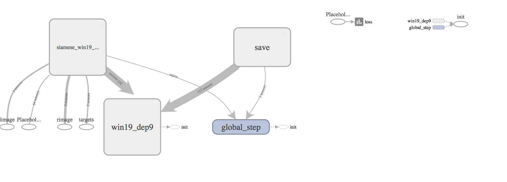
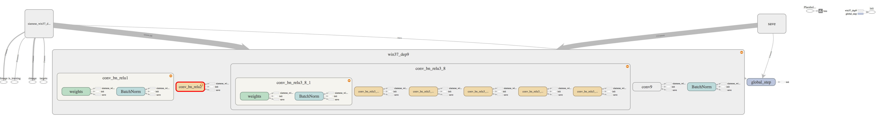
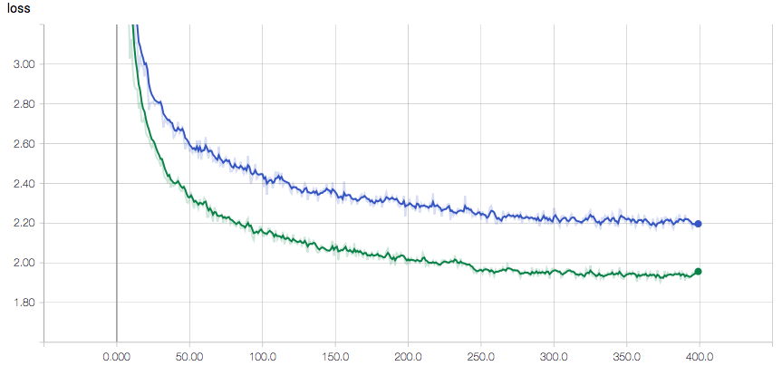

# Siamese Deep Neural Networks for Stereo Matching
A Tensorflow implementation of the models described in the paper [Efficient Deep Learning for Stereo Matching](https://www.cs.toronto.edu/~urtasun/publications/luo_etal_cvpr16.pdf).
This implementation is based on the one provided by the authors of the paper 
at: https://bitbucket.org/saakuraa/cvpr16_stereo_public/overview

### Architecture of the win37_dep9 network:
#### Global view

#### Detailed view



## Installation
1. Install Tensorflow

2. Clone the repository 

```
git clone https://github.com/fjulca-aguilar/dl_stereo_matching.git
```
## Training new models
New models can be trained using

```
python train.py --util_root=PATH_BINARY \
--data_root=PATH_DATABASE \
--net_type=win19_dep9 \
--patch_size=19 \
--model_dir=MODEL_DIR \
--phase=train &
```
The training and evaluation schemes use the same training data and 
similar parameters to the ones defined at 
https://bitbucket.org/saakuraa/cvpr16_stereo_public/overview

Training evolution and graphs can be seen using Tensorboard. 
The following image shows examples of Cross-entropy Loss 
evolution for 40 000 training steps (horizontal axes represent the the number of 
iterations * 100): (blue = win19_dep9, green = win37_dep9)




## Evaluation on validation patches
Trained models can be evaluated on validation patches using

```
python train.py --util_root=PATH_BINARY \
--data_root=PATH_DATABASE \
--net_type=win19_dep9 \
--patch_size=19 
--model_dir=MODEL_DIR
--phase=evaluate &
```

## Testing on images 
Evaluation on images can be done using

```
python test_images.py \ 
--out_dir=OUT_IMAGES_DIR \
--model_dir=MODEL_DIR \
--data_root=PATH_DATABASE \
--util_root= PATH_BINARY\
--net_type=win19_dep9 \
--patch_size=19 \
--num_imgs=10 &
```
The script generates `num_imgs` disparity images and saves them 
at the OUT_IMAGES_DIR directory